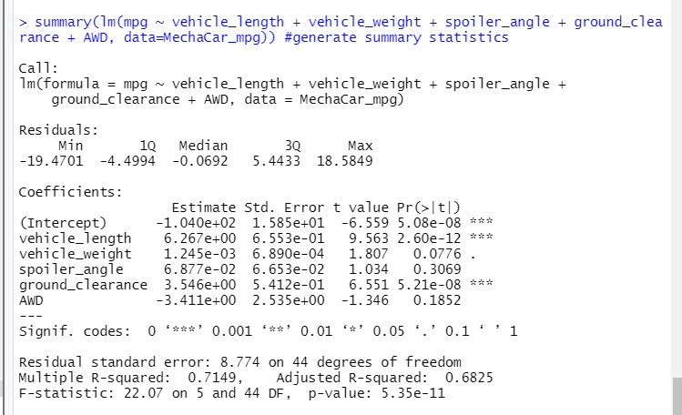
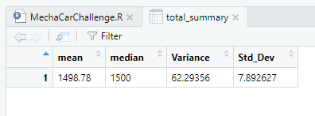
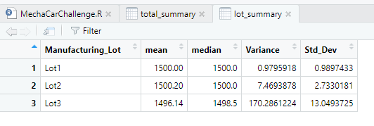
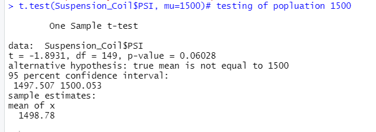
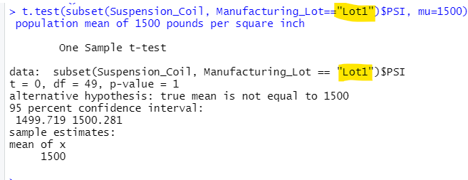
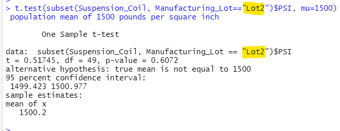
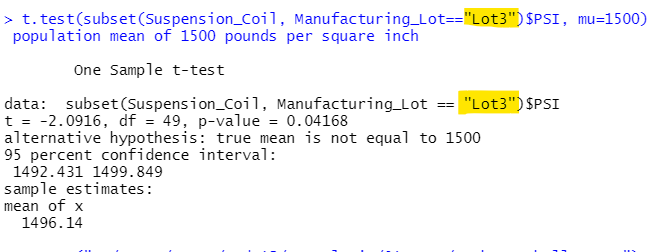

# MechaCar_Statistical_Analysis
Module 15 Challenge

## Linear Regression to Predict MPG

- Which variables/coefficients provided a non-random amount of variance to the mpg values in the dataset?

  - Vehicle length and ground clearance provide a non-random amount of variance to the mpg values. According to our results, vehicle length and ground clearance (as well as intercept) are statistically unlikely to provide random amounts of variance to the linear model. In other words the vehicle length and ground clearance have a significant impact on mpg values.
  
- Is the slope of the linear model considered to be zero? Why or why not?

  - The slope of the linear model is not consired to be zero. The p is much smaller than our assumed significance level of 0.05%. Therefore, we can state that there is sufficient evidence to reject our null hypothesis, which means that the slope of our linear model is not zero.

 - Does this linear model predict mpg of MechaCar prototypes effectively? Why or why not?

   - Yes, this linear model predicts mpg of MechaCar prototypes effectively. According to the summary output, the r-squared value of 0.7 is strong, while the p-value 5.35e-11 is significant.
  
  -  

## Summary Statistics on Suspension Coils

The design specifications for the MechaCar suspension coils dictate that the variance of the suspension coils must not exceed 100 pounds per square inch.

- The current manufacturing data meets this design specification for all manufacturing lots in total with Variance of 62.9.

 
 
 - The current manufacturing data does not meet this design specification on each lot individually.  Lot 3 has a very high variance at 170, when compared to lots 1 and 2 with variances of 1.0 and 7.5.
 
 
 
 ## T-Tests on Suspension Coils

T-tests were performed to determine if all manufacturing lots and each lot individually are statistically different from the population mean of 1,500 pounds per square inch.
 
- For all lots the we can not reject the null hypothesis because the p-value = 0.06, which is higher than our assumed significance level of 0.05%.  This means that the all manufacturing lots are statistically similar to the population mean of 1,500 pounds per square inch.
 
 

- For Lot 1 we can not reject the null hypothesis because the p-value = 1, which is higher than our assumed significance level of 0.05%. This means that for Lot 1 the manufacturing lot is statistically similar to the population mean of 1,500 pounds per square inch.
 
 

- For Lot 2 we can not reject the null hypothesis because the p-value = 0.6, which is higher than our assumed significance level of 0.05%. This means that for Lot 2 the manufacturing lot is statistically similar to the population mean of 1,500 pounds per square inch.
 
 
 
- For Lot 3 we can reject the null hypothesis because the p-value = 0.04, which is lower than our assumed significance level of 0.05%. This means that for Lot 3 the manufacturing lot is not statistically similar to the population mean of 1,500 pounds per square inch.
 
 
 
 ## Study Design: MechaCar vs Competition
 
- What metric or metrics are you going to test?

- What is the null hypothesis or alternative hypothesis?

- What statistical test would you use to test the hypothesis? And why?

- What data is needed to run the statistical test?
 
 
 
